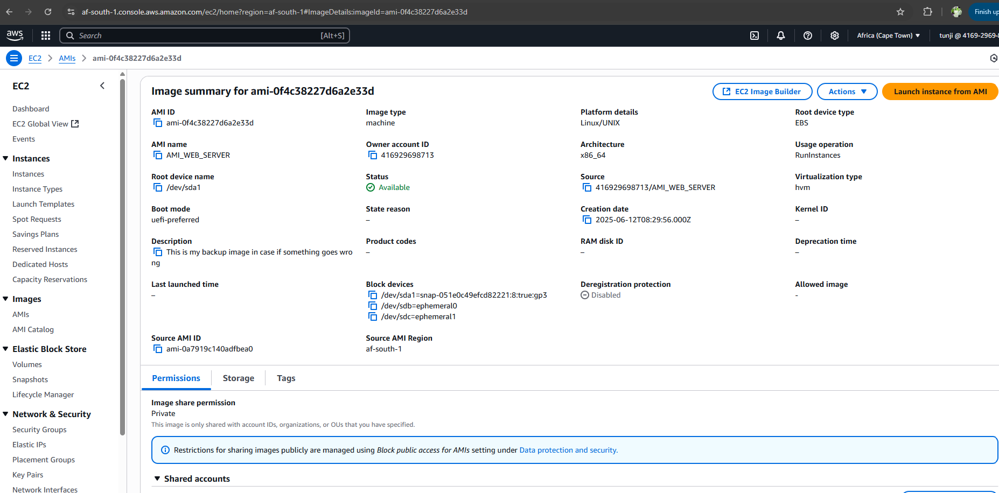

# Ease-Event

www.easeevent.com.ng
FQDN: http://easeevent-1555272296.af-south-1.elb.amazonaws.com
I created a CNAME on my domain provider which points the ALB DNS to my domain: www.easeevent.com.ng
## Introduction
This repository contains my Second Semester Examination project in Alt School.
Name: Adetoro Adetunji Olanrewaju
STUDENT ID: **ALT/SOE/024/1852**
TINUKA2024

# SERVER SETUP:
I configured an EC2 Machine on AWS in the african region which is the closest availability ZOne to me. For the purpose of the project, the EC2 has specs available in the free tier for AWS. The EC2 has a storage of 8GB on the/dev/sda partition:

I also made sure the server was updated after provisioning with the command below:

sudo apt-get update -y
sudo apt-get upgrade -y
sudo apt install update -y

# WEBSERVER SETUP
I went ahead to install my web sever (Apache)
sudo apt install apache2 -y

Then i enabled and started the server using the commands below:
systemctl start apache2
systemctl enable apache2

on my EC2 settings, i also ensured to modifiy the security group to allow traffic from HTTP and HTTPs services as well as SSH 

I tested with the public IP and it rendered the page as seen: 

# SERVER DEPLOYMENT
I removed the index.html file that came by default with apache using the command:
sudo rm /var/www/html/index.html

Then i cloned tha codebase of my project from github to a directory on the server using the commands
git init
git clone <[remote url](https://github.com/adetoro1989/ease-event.git)>

The folder was cloned to the directory and then i copied the whole folder to the /var/www/html directory using the command below:
sudo cp /home/ubuntu/project/ease-event/* /var/www/html/

Then i modified the permission on the /var/www/html folder with the commands below:
sudo chown -R www-data:www-data /var/www/html
sudo chmod -R 755 /var/www/html

I tested my page using the public IP: 13.245.231.101 and it rendered the page    

# DISASTER RECOVERY
For disaster recovery: in the case of an incidence on the EC2 instance, i created an AMI (Amazon Machine Image) which grabbed the instance state of the server so i can easily deploy the server quickly in the event of an incidence. Please see screenshot: 

As part of Disaster Recovery policy, I hosted my EC2 machines in two different AZs within the african region and they are both running simultaenously. Since we forsee a very large traffic over time, i created an Applicaton Load Balancer (ALB) that will spread the traffic across the two instances as traffics are coming in. 

I used a custom FQDN to reach my application: FQDN: http://easeevent-1555272296.af-south-1.elb.amazonaws.com 

I created a target group which i added my two ec2 machines and i can do a health check over time [Target-group](image-8.png)

I also ensured that each individual machines cannot be reached over the internet via thier public IPs except for SSH reasons(management) by modifying the security group of the Load balancer and the ec2 machines. I made sure only the ALB can be reached over the internet  and the EC2 machines can be reached from the Load balancer security group 